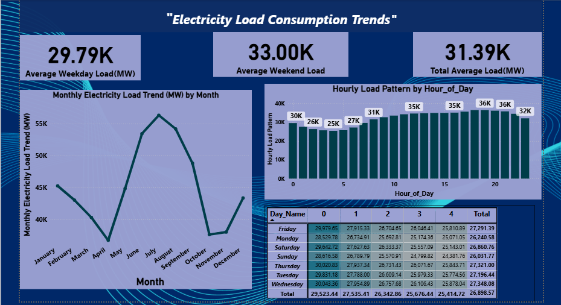

Electricity-Load-Consumption-Trends

Electricity load consumption analysis using Excel, SQL, and Power BI, based on the PJME Hourly Energy Consumption dataset.

Project Overview
This project analyzes hourly electricity load (in megawatts) for the PJM Interconnection region (a regional transmission organization covering parts of the eastern US) to uncover consumption patterns across hours of the day, days of the week, and months of the year. The goal is to identify peak demand periods and seasonal trends that could support load forecasting and capacity planning.

Tools Used
- Excel: Data cleaning, feature extraction (hour, day name, month, year) using formulas, and pivot table analysis
- SQL (MySQL): Structured storage and querying of the hourly load dataset
- Power BI: Interactive dashboard for visualizing load trends

Data Source
Hourly electricity load data (PJME_MW) with timestamps, originally sourced from PJM Interconnection hourly energy consumption records.

Process
1. Data Cleaning (Excel): Extracted Hour, Day of Week, Month, and Year from the raw datetime column using formulas (HOUR, TEXT, YEAR, MONTH)
2. Database Import (SQL): Loaded the raw CSV into a MySQL database, converted the datetime column to a proper DATETIME type, and structured it into a clean table for querying
3. Analysis (Excel Pivot Tables): Built pivot tables to calculate average load by hour, by day of week, and by month
4. Visualization (Power BI): Built an interactive dashboard summarizing key metrics and trends

Key Insights
- Average Weekday Load: 29.79K MW
- Average Weekend Load: 33.00K MW
- Total Average Load: 31.39K MW
- Load peaks during afternoon and evening hours (roughly 15:00 to 20:00), reaching around 35K to 36K MW
- Load is lowest in early morning hours (around 1:00 to 5:00 AM)
- Monthly trend shows a strong summer peak (around June to August), consistent with higher air conditioning demand

Dashboard Preview

Files in this Repo
- PJME_hourly.xlsx: Raw dataset with Excel formulas and pivot table analysis
- PJME_Data_Import.sql: SQL script for importing and structuring the data in MySQL
- Electricity_Load_Consumption_Trends.pbix: Power BI dashboard file
- Electricity_Load_Dashboard.png: Dashboard preview image

How to Use
1. Clone or download this repository
2. Open Electricity_Load_Consumption_Trends.pbix in Power BI Desktop to explore the interactive dashboard
3. Open PJME_hourly.xlsx to review the raw data and pivot table calculations
